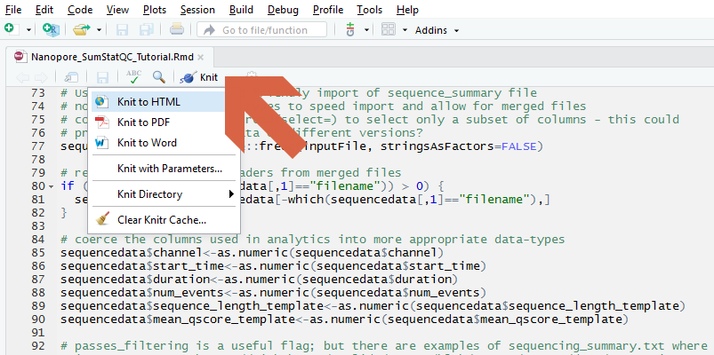

******************

# 1. Introduction:


### Overview:

The **Evaluation of read-mapping characteristics from a Cas-mediated PCR-free enrichment** tutorial demonstrates a workflow for mapping long DNA sequence reads to a reference genome, and evaluates the performance of a Cas9 based target enrichment strategy. This workflow is suitable for Oxford Nanopore fastq sequence collections and requires a reference genome and a BED file of target coordinates.

### Features:

Sufficient information is provided with the tutorial so that the workflow can be tested, validated, and replicated. The tutorial is provided with real sequence data from an enrichment workflow utilising the **`HTT`** gene. The full sequence set has been reduced down to just the sequence reads that were mapped to human (GRCh38) chromosome 4. The tutorial aims to address quantitative and qualitative questions that include

* How many sequence reads map to the reference genome?
* What is the depth of coverage for reads that map to pre-defined target regions?
* What is the background depth of coverage for the genomic regions that do not correspond to targets?
* Is there evidence for off-target enrichment of genomic regions?
* How has the Cas9 based target-enrichment worked for **`HTT`**, our gene of interest?
* How can we visualise regions of mapping using the IGV software?


******************

# 2. Getting started:

### Input and output: 

This tutorial uses the R markdown contained within this Github repository and an experimental design file (config.yaml) to define a reference genome, a fastq format sequence collection and a BED file containing the target coordinates. An example design file is included in the repository along with example sequences and a BED file for the HTT gene. The result of the tutorial will be a tutorial report file in **`html`** format. Fastq format supplementary files are also produced that contain the on-target and off-target sequence reads are also produced along with a sequence summary in .xlsx format suitable for review using Microsoft Excel. 

### Dependencies:

This tutorial requires a computer running Linux (Centos7, Ubuntu 18_10, Fedora 29) or macOS. >16 Gb of memory would be recommended. The tutorial has been tested on minimal server installs of these operating systems.

Other dependencies include

* **`Conda`** is required by this tutorial and orchestrates and manages the installation of other required software
* **`R`** is a statistical analysis software and is used for the analysis and reporting of the sequence summary data
* **`Rstudio`** is a graphical user interface to **`R`** and provides much of the required reporting framework
* **`git`** packages for downloading the tutorial from Github repository.
* **`git-lfs`** is required to download the sequence and metadata files provided with the tutorial.
* **`minimap2`** is used for mapping the fastq format DNA sequence reads against the reference genome
* **`samtools`** is used to handle the `sam` and `bam` format mapping data
* **`snakemake`** is required for the automation and pipelining of the bioinformatics workflow used for data analysis
* **`RSamtools`** and **`GenomicAlignments`**; R software for parsing BAM files
* **`seqtk`** for writing out the subseq of sequence reads that map to the target region
* **`IGV`** for visualising mapping characteristics at specific genomic regions


### Installation:

1. Most software dependecies are managed using **`conda`**. Please install as described at  <br> [https://conda.io/docs/install/quick.html](https://conda.io/docs/install/quick.html).
```
    wget https://repo.anaconda.com/miniconda/Miniconda3-latest-Linux-x86_64.sh
    bash Miniconda3-latest-Linux-x86_64.sh
    bash
```
2. Download Nanopore tutorials & example files into folder named `ont_tutorial_cas9`. This tutorial requires the **`git-lfs`** large file support capabilities; this should be installed first through **`conda`**
```
    conda install -c conda-forge git-lfs
    git lfs install
    git clone https://github.com/nanoporetech/ont_tutorial_cas9.git ont_tutorial_cas9
```
3. Change working directory into the new `ont_tutorial_cas9` folder 
```
    cd ont_tutorial_cas9
```
4. Install conda software dependencies with
```
    conda env create --name ont_tutorial_cas9 --file environment.yaml
```
5. Initialise conda environment with 
```
    conda activate ont_tutorial_cas9
```

#### Compilation From Source

This tutorial does not contain software that requires compilation. All packages are managed by the **`Conda`** package management software


### Usage: 

In your Conda environment, and in the tutorial working directory,

1. *optional* edit the provided **`config.yaml`** file to match your own sequence files, reference genome and annotation. Update the BED format coordinates that define the genomic regions that have been targeted.
2. Run the **`snakemake`** command to perform the bioinformatics analysis on the specified sequence files. Several analysis steps can benefit from multiple computer cores; use the `-j` parameter to parallise the analysis (this document is assuming that 8 cores are available).
```
    snakemake -j 8 all
```
3. Render the tutorial report using the command below
```
    R --slave -e 'rmarkdown::render("ont_tutorial_cas9.Rmd", "html_document")'
```

The provided Rmarkdown tutorial script can also be opened (and edited) directly in Rstudio

```
rstudio ont_tutorial_cas9.Rmd
```

The report can also be prepared using the "knit" command from the GUI as shown in the figure




******************

# 3. Results

This tutorial workflow will produce a rich description of your sequence library characteristics and the results from the Cas-mediated PCR-free enrichment analysis. Please visit the tutorial page at [https://community.nanoporetech.com/knowledge/bioinformatics](https://community.nanoporetech.com/knowledge/bioinformatics) for further information

******************

# 4. Help:

### Licence and Copyright:

© 2019 Oxford Nanopore Technologies Ltd.

Bioinformatics-Tutorials is distributed by Oxford Nanopore Technologies under the terms of the MPL-2.0 license.

### FAQs:


### Abbreviations:


* __knit__ is the command to render an Rmarkdown file. The knitr package is used to embed code, the results of R analyses and their figures within the typeset text from the document. 

* __L50__  describes the number of sequences (or contigs) that are longer than, or equal to, the N50 length and therefore include half the bases of the assembly

* __N50__  describes the length (read length, contig length etc) where half the bases of the sequence collection are contained within reads/contigs of this length or longer

* __Rmarkdown__ is an extension to markdown. Functional R code can be embedded in a plain-text document and subsequently rendered to other formats including the PDF format of this report.

* __QV__  the quality value, -log10(p) that any given base is incorrect. QV may be either at the individual base level, or may be averaged across whole sequences
