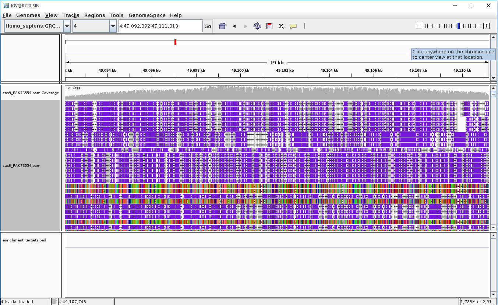

<div style="position:absolute;top:0px;right:0px;padding:15px;background-color:gray;width:45%;">
```{r, echo=FALSE}
knitr::include_graphics("https://nanoporetech.com/themes/custom/nanopore/images/ont-logo.svg?tutorial=cas9enrichment")
```
</div>


```{r setup, include=FALSE}
knitr::opts_chunk$set(tidy=TRUE, tidy.opts=list(width.cutoff=80), 
                      fig.width=9, fig.height=6, warning=FALSE, message=FALSE, 
                      kable.force.latex=TRUE,
                      highlight=TRUE,
                      cache.path="Analysis/Cache/",
                      knitr.table.format = "html",
                      width = 120,
                      knitr.kable.NA = '')

options(knitr.kable.NA = '')

library(yaml)
library(session)
library(kableExtra)
library(ggplot2)
library(RColorBrewer)
library(scales) # required for comma
library(reshape2)
library(parallel)
library(GenomicAlignments)
library(dplyr)
library(emojifont)
library(ggbio)
library(xlsx)
library(tibble)

config <- yaml.load_file("config.yaml")
bed_src <- config$target_regions
study <- config$study_name
reference <- config$reference_genome
target_proximity <- as.integer(config$target_proximity)
offtarget_level <- as.integer(config$offtarget_level)
tutorialText   <- config$tutorialText
gstride <- as.integer(config$gstride)

### here lie dragons ###
# expeditions below this comment at your own risk
# welcome feedback and suggestions ...

slurpContent <- function(filename) {
  include = as.logical(tutorialText)
  if (include) {
    paste(readLines(filename),collapse="\n")
  }
}

referenceFile <- file.path("ReferenceData", basename(reference))
reportDPI <- 90
colMax <- 4

#knitr::knit_exit()
```


`r slurpContent("Static/TutorialPreamble.md")`

```{r, echo=FALSE}
r_results <- file.path("Analysis","R")
# if r_results does not exist the snakemake either failed or has not run -- flag a warning?
```


```{r, echo=FALSE}
# load the general mapping results and analysis ...
mappingResultsFile <- file.path(r_results, paste0(study, "_mapping_results", ".Rdata"))
load(mappingResultsFile)

# load the aggregated coverage file - used for plotting coverage at finer resolution for the pre-defined targets
aggregatedCovFile <- file.path(r_results, paste0(study, "_aggregated_coverage", ".Rdata"))
load(aggregatedCovFile)

# load the sequence metadata for the unmapped sequence reads
qualfilelocation = file.path("Analysis","Minimap2", paste0(study, ".unmapped.quals"))
chromosomeFile <- file.path(r_results, paste(sub("\\.[^.]*$", "", basename(qualfilelocation)), "rcounts", "Rdata",sep="."))
unmappedReads <- readRDS(file=chromosomeFile)

phredmean <- function(l) {
  -10 * log10(mean(10^(l/-10)))
}
```


# Analysis of the fastq format sequence data

## Mapping sequence reads to the reference genome

The first step for the analysis of the Cas9 enrichment strategy is to assess the distribution and regional coverage of sequence reads across the whole genome. The **`fastq`** sequences produced during the DNA sequencing are mapped to the reference genome using the Minimap2 software (@minimap22018). Results from the mapping analysis are passed to the **`samtools`** software (@samtools2009). **`Samtools`** is used to (1) filter out the unmapped sequence reads, (2) convert the uncompressed Minimap2 SAM format output into the compressed BAM format and to (3) sort the sequences in the BAM file by their mapping coordinates. Further indexing the BAM file (again, using Samtools) enables efficient access to BAM entries that correspond to specific genomic locations.


## Definition of background and off-target regions of the genome

The DNA sequence reads from sequencing have been mapped to their optimal genomic locations. To understand the characteristics of the enrichment analysis it is necessary to consider separately targetted and untargetted regions of the genome. To effectively understand the enrichment characteristics, the genome is considered as blocks of non-overlapping sequence regions. These blocks can be considered as belonging to four different mutually exclusive groups. These groups are

* The **`On Target`** regions that are defined as regions of interest in the provided **`BED`** format coordinate file (*`r bed_src`*)
* The **`Target Flanking`** regions that are immediately upstream or downstream of an On Target region (this regions is defined as `r as.integer(target_proximity)` bases)
* The **`Background`** regions of the genome have a stochastic coverage
* The **`Off Target`** regions are defined as the subset of the background genome that has a depth-of-coverage of > **`r offtarget_level`** -times that of the mean background level.

Target regions are calculated using the genome coordinates from the provided reference genome (`r basename(reference)`) and the **R** **`GenomicRanges`** package (@granges2013) is used to select for the coordinates that correspond to **`OnTarget`**, **`TargetFlanking`** and **`Background`** regions. The genome is sampled as non-overlapping windows with a stride (window size) of **`r gstride`** nucleotides. 

The BAM file produced during the mapping analysis is loaded into memory as a **`GenomicAlignments`** object, in R, using the **`Rsamtools`** package (@R-rsamtools) and **`GenomicAlignments`** (@granges2013) packages. Reads overlapping the genomic windows were summarised using the **`GenomicRanges::binnedAverage`** method.

The mean-depth of coverage for genomic regions that are not **on-target** or **target-proximal** was measured as **`r round(wga.cov, digits=2)`**.

Off-target regions of the genome were selected by identifying the sequence windows with a mean depth-of-coverage of > **`r round((wga.cov * offtarget_level), digits=2)`**. The windows of length=(`r gstride`) were collapsed into their maximal contiguous blocks using the **`reduce`** method from the **`R`** **`GenomicRanges`** package. 

The collapsed genomic windows corresponding to **ontarget**, **offtarget**, **targetproximal** and **background** were further analysed for their characteristics. These observations are presented in this report.


## Executive Summary


```{r seqInfoPlot, include=TRUE, echo=FALSE, fig.fullwidth = TRUE, dpi=360, fig.width=9, fig.height=2}

figures <- 4

cas9Throughput <- sum(backgroundUniverse$basesstart) + sum(unmappedReads$width) + 
  sum(offtargetUniverse$basesstart) + 
  sum(targetproximalUniverse$basesstart) + 
  sum(ontargetUniverse$basesstart)
cas9Throughput <- paste(round(cas9Throughput / 1e9, digits=2), "Gb")
    
#ontargetLabel <- paste(round(sum(ontargetUniverse$basesstart) / (sum(backgroundUniverse$basesstart) + sum(unmappedReads$width) + sum(offtargetUniverse$basesstart) + sum(targetproximalUniverse$basesstart) + sum(ontargetUniverse$basesstart)) * 100, 2), "%")
ontargetLabel <- paste0(round(sum(ontargetUniverse$rstart) / (sum(ontargetUniverse$rstart) + length(unmappedReads) + sum(offtargetUniverse$rstart) + sum(targetproximalUniverse$rstart) + sum(backgroundUniverse$rstart)) * 100, digits=2), "%")
meanCovLabel <- paste0(round(mean(rep(ontargetUniverse$dmean, width(ontargetUniverse))), digits=1), "X")

depletionLabel = paste0(round(Hmisc::wtd.quantile(ontargetUniverse$dmean, probs=c(0.5), weight=width(ontargetUniverse)) / Hmisc::wtd.quantile(as.numeric(backgroundUniverse$dmean), probs=c(0.5), weight=as.numeric(width(backgroundUniverse))), digits=1), " X")

df <- data.frame(
    x = cumsum(c(2, rep(6.5, figures-1))),
    y = rep(2, figures),
    h = rep(4, figures),
    w = rep(6, figures))

    df$info <- c(cas9Throughput, ontargetLabel, meanCovLabel, depletionLabel)
    df$key <- c("Throughput", "reads on target", "mean target coverage", "non-target depletion")
    df$icon <- fontawesome(c("fa-calculator", "fa-cut", "fa-map", "fa-code-fork"))

    df$colour <- rep("steelblue", figures)

ReadCharacteristicsValueBoxes <- ggplot(df, aes(x, y, height = h, width = w, label = key, fill = colour)) +
    geom_tile(fill = brewer.pal(9,"Blues")[7]) +
    geom_text(color = brewer.pal(9,"Blues")[3], hjust="left", nudge_y=-1.5, nudge_x=-2.6, size=3.5) +
    geom_text(label=df$icon, family='fontawesome-webfont', colour=brewer.pal(9,"Blues")[5], size=14, hjust="right", nudge_x=2.85, nudge_y=0.9) +
    geom_text(label=df$info, size=9, color = brewer.pal(9,"Blues")[2], fontface = "bold", nudge_x=-2.6, hjust="left") +
    coord_fixed() + 
    scale_fill_brewer(type = "qual",palette = "Dark2") +
    theme_void() +
    guides(fill = F)


ggplot2::ggsave(file.path(r_results, "EnrichmentValueBoxesA.png"), plot=ReadCharacteristicsValueBoxes, device="png", units="cm", width=25, height=5, dpi=reportDPI)

knitr::include_graphics(file.path(r_results, "EnrichmentValueBoxesA.png"))

```


This infographic figure presents the key metrics that are required for benchmarking the performance of a DNA sequencig run following the  *Cas-mediated PCR-free enrichment protocol*. 

* Oxford Nanopore Technologies expects a lower flowcell throughput following a Cas-mediated enrichment protocol. The expected throughput may vary between 1 and 3.5Gb depending on the number of gene-targets and number of pooled-samples that are included in the sequencing run
* 5-10% of the sequenced data should be on target. If less than 5% of data is on target then please consider RNA stability, input quality and probe design. Please review the [Cas-mediated PCR-free enrichment protocol](https://community.nanoporetech.com/protocols/Cas-mediated-PCR-free-enrich/) and consider a call with the Nanopore technical support team
* The mean coverage per target should be >200X. If you mean coverage does not reach this level please consider your probe design and DNA quality. Please review the [Cas-mediated PCR-free enrichment protocol](https://community.nanoporetech.com/protocols/Cas-mediated-PCR-free-enrich/) 
* Oxford Nanopore Technologies typically observes a 3000X depletion of non-target DNA.


## Mapping characteristics by genomic segments

In a previous section, we described the stratification of the genome sequence into regions that are *on-target*, *off-target*, *target proximal* and *background*. The genomic coordinates were **`reduced`** to their minimal sets of non-overlapping coordinates and these regions have been annotated for the number of mapped sequence reads and other sequence characteristics. The table below outlines some of the key observations from each of these groups.


```{r summaryStatistics, echo=FALSE, results="asis", eval=TRUE}

addRow <- function(df, metric, count, percentage="") {
  return(df %>% add_row(metric=metric, count=count, percentage=percentage))
}

collateMappingCharacteristics <- function(bamFile, unmappedBamFile=NA) {
  suppressWarnings(if ( !is(unmappedBamFile, "data.frame") && is.na(unmappedBamFile)) { unmappedBamFile <- data.frame(width=numeric(), quality=numeric()) })
  # basic counts for #s of reads
  mappedSeqs <- sum(bamFile$rstart)
  unmappedSq <- nrow(unmappedBamFile)
  totalReads <- mappedSeqs + unmappedSq
  # basic counts for #s of nucleotides
  mappedNts <- sum(bamFile$basesstart)
  unmappedNts <- sum(unmappedBamFile$width)
  fastqNts <- mappedNts + unmappedNts
  mappedClippedNts <- sum(bamFile$cigarmapped)
  
  # reference genome characteristics
  refSize <- paste0(round(sum(as.numeric(width(bamFile))) / effectiveGenomeSize * 100, digits=3),"%")

  meanCov <- sum(bamFile$dmean * width(bamFile), na.rm=TRUE) / sum(width(bamFile), na.rm=TRUE)
  
  summary.df <- data.frame(metric=character(), count=character(), percentage=character(), stringsAsFactors = FALSE)
  summary.df <- addRow(summary.df, "total sequence reads", scales::comma_format()(totalReads))
  summary.df <- addRow(summary.df, "mapped reads (primary)", scales::comma_format()(mappedSeqs))
  summary.df <- addRow(summary.df, "bases sequenced", scales::comma_format()(fastqNts))
  summary.df <- addRow(summary.df, "bases mapped", scales::comma_format()(mappedNts))
  summary.df <- addRow(summary.df, "Fraction of genome (%)", refSize)
  summary.df <- addRow(summary.df, "Mean coverage (primary)", round(meanCov, digits=2))
  
  rownames(summary.df) <- summary.df[,1]
  summary.df <- summary.df[,-1]
  return(summary.df)
}

effectiveGenomeSize <- sum(width(backgroundUniverse)) + sum(width(offtargetUniverse)) + sum(width(targetproximalUniverse)) + sum(width(ontargetUniverse))

summary.df <- as.data.frame(cbind(collateMappingCharacteristics(backgroundUniverse, unmappedReads), 
                    collateMappingCharacteristics(offtargetUniverse),
                    collateMappingCharacteristics(targetproximalUniverse),
                    collateMappingCharacteristics(ontargetUniverse)))

summary.df <- summary.df[,-c(2,4,6,8)]
summary.df[summary.df == "NaN"] <- ""


row.names(summary.df)[1]<- paste0(row.names(summary.df)[1], footnote_marker_symbol(1, "html"))
row.names(summary.df)[2]<- paste0(row.names(summary.df)[2], footnote_marker_symbol(2, "html"))
row.names(summary.df)[6]<- paste0(row.names(summary.df)[6], footnote_marker_symbol(3, "html"))
#row.names(summary.df)[16]<- paste0(row.names(summary.df)[16], footnote_marker_symbol(4, "html"))
#row.names(summary.df)[17]<- paste0(row.names(summary.df)[17], footnote_marker_symbol(5, "html"))

kable(summary.df, format="html", col.names=rep(" ", ncol(summary.df)), caption="Table summarising global mapping characteristics ranked by on-target, target-flanking and off-target", booktabs=TRUE, table.envir='table*', linesep="", escape = FALSE)  %>%
  add_header_above(c(" ", "Background"=1,"Off-Target"=1,"Target-flanking"=1,"On-Target"=1)) %>%
  kable_styling(c("striped", "condensed")) %>%
  footnote(symbol=c("fastq bases are calculated from the qwidth field of the mapped sequences and from the sequence length of unmapped sequences", "this table presents only primary sequence mappings", "depth of coverage based only on primary mapping reads"), symbol_title="please note: ", footnote_as_chunk = TRUE)


```


* The overall sequence throughput following the *Cas-mediated PCR-free enrichment protocol* is expected to be lower than the throughput following a non-enrichment protocol such as the LSK109 sequencing protocol. The target is a very small fraction of the complete genome space.
* 5-10% of sequence should correspond to the *on-target* segment of the genome. If less than 5% of data is on target then please consider RNA stability, input quality and probe design. Please review the [Cas-mediated PCR-free enrichment protocol](https://community.nanoporetech.com/protocols/Cas-mediated-PCR-free-enrich/) and consider a call with the Nanopore technical support team
* Background reads result from the incomplete dephosphorylation of the genomic DNA followed by a non-specific ligation of the adapter sequence
* Off-target reads result from the Cas9 protein cutting the DNA at a genomic location outside of the target region. Further graphs to show the location and distribution of off-target regions is presented later in the report. If the number of off-target regions and reads is higher than desired, please review the probe design to assess possible SNPs and candidate sequence mismatches
* Comparing the number of bases or reads classified as *target-flanking* relative to *on-target* values shows the efficiency of the probe design. A high number of reads/bases classified as *target-flanking* indicates read-through; it would be recommended to review the probe design for the crRNA probe that appears to "leak".


## Evaluation of individual target performance

The previous table describes the key characteristics for the different target strata of the genome. To gain the best insight on the performance of the *Cas-mediated PCR-free enrichment protocol* it is preferable to consider the performance of each discrete target separately. The table below highlights the characteristics for the different target regions defined within the starting BED file.


```{r, echo=FALSE, results="asis", eval=TRUE}
bygene <- cbind(names(ontargetUniverse), scales::comma_format()(width(ontargetUniverse)), round(ontargetUniverse$dmean, digits=2),  scales::comma_format()(ontargetUniverse$rstart), scales::comma_format()(ontargetUniverse$basesstart), scales::comma_format()(round(ontargetUniverse$meanreadlen, digits=2)), round(ontargetUniverse$readq, digits=2), round(ontargetUniverse$mapq, digits=2), round(ontargetUniverse$strandp / ontargetUniverse$rstart*100, digits=2))
colnames(bygene) <- seq(1, ncol(bygene))

colnames(bygene)[1]<- paste0("Target Gene")
colnames(bygene)[2]<- paste0("Target size")
colnames(bygene)[3]<- paste0("Mean coverage")
colnames(bygene)[4]<- paste0("Read count", footnote_marker_symbol(1, "html"))
colnames(bygene)[5]<- paste0("Bases", footnote_marker_symbol(2, "html"))
colnames(bygene)[6]<- paste0("Mean readLength")
colnames(bygene)[7]<- paste0("Mean readQuality")
colnames(bygene)[8]<- paste0("Mean mapQuality")
colnames(bygene)[9]<- paste0("Reads on FWD(%)", footnote_marker_symbol(3, "html"))

kable(bygene, format="html", caption="Table summarising target mapping for pre-defined regions of interest", booktabs=TRUE, table.envir='table*', linesep="", escape = FALSE)  %>%
  kable_styling(c("striped", "condensed")) %>%
  footnote(symbol=c("Reads are counted as all sequence reads where the SAM start location is located within the target interval. This does not correct for sequences on the reverse strand.", "Bases are counted as the sum of nucleotides from all reads where the SAM start location is within target region; some of these bases will overlap the flanking region", "reads are assessed for strand of mapping; here reads on + strand are summarised as percentage of all"), symbol_title="please note: ", footnote_as_chunk = TRUE)

```


* The mean coverage per target should be >200x. If the coverage is below the desired level please review the probe design and the input DNA quality. Please check review the [Cas-mediated PCR-free enrichment protocol](https://community.nanoporetech.com/protocols/Cas-mediated-PCR-free-enrich/)
* Reads on FWD(%) indicates the percentage of sequence reads that map to the forward strand. If this value is not in the region of 50% then one of the probes is not working effectively. Please check the *probe design advice* in the [Cas-mediated PCR-free enrichment protocol](https://community.nanoporetech.com/protocols/Cas-mediated-PCR-free-enrich/) 
* A perfect mean map quality should be 60. A value of 60 indicates that reads are mapping to a single location in the genome (the target location). Lower mapping qualities may indicate either fragmented mapping (blocks of sequence interspersed by regions of no mapping at a single genomic location) or multi-mapping (the sequences can be mapped to multiple locations in the genome) leading to off-target effects.
* Comparison of target read lengths may be used to identify the targets (and their probes) that either allow read-through. The ratio between the mean read length and target size should also be considered.


```{r targetGeneDepths, echo=FALSE}

suppressWarnings(posMatrix <- matrix(gtools:::mixedsort(names(br)), ncol=colMax, byrow=TRUE))
  # data may be recycled ... remove duplicate values ...
posMatrix[which(duplicated(posMatrix[seq(nrow(posMatrix) * ncol(posMatrix))]))]<-NA

plotLegend <- paste0("t::",gtools:::mixedsort(names(br)))
plotCols <- ceiling(length(plotLegend) / colMax)
legendDF <- data.frame(x=Inf, y=Inf, 
                         lab=plotLegend, 
                         row=unlist(lapply(1:plotCols, rep, times=colMax))[1:length(plotLegend)], 
                         col=rep(seq(1, colMax), length.out=length(plotLegend)))

# add row and column data to aggregatedGR
#aggregatedGR$row <- unlist(lapply(aggregatedGR$gene, function(x) { which(posMatrix==x, arr.ind=TRUE)[[1]] }))
#aggregatedGR$col <- unlist(lapply(aggregatedGR$gene, function(x) { which(posMatrix==x, arr.ind=TRUE)[[2]] }))
#
# - this lapply uses the whole data and takes a little too long ..
aggregatedGR$row <- 0
aggregatedGR$col <- 0
for (gid in unique(mcols(aggregatedGR)$gene)) {
  matrixpos <- which(posMatrix==gid, arr.ind=TRUE)
  matchrows <- which(mcols(aggregatedGR)$gene==gid)
  aggregatedGR$row[matchrows] <- matrixpos[[1]]
  aggregatedGR$col[matchrows] <- matrixpos[[2]]
}
aggregatedGR$rev_cov <- aggregatedGR$binned_cov - aggregatedGR$fwd_cov

singlePlot <- function(geneName, covData, delta=0) {
  delta=min(delta, target_proximity)
  covData <- as.data.frame(covData)
  covData <- covData[which(covData$gene==geneName),]
  offset <- covData[covData$pos==1,]$start
  suppressWarnings(plot <- ggplot(covData)+
    geom_hline(yintercept=(wga.cov * offtarget_level), colour="#E69F00") +
    geom_line(aes(x=start,y=binned_cov), size=0.5, colour=brewer.pal(6, "Paired")[2])+
    xlab(paste("Position on chromosome",unique(covData$seqnames))) + 
    ylab("Depth of Coverage (X)") + 
    labs(title=paste("Plot showing depth of coverage vs position for target", geneName)) + 
    geom_vline(xintercept=(offset+target_proximity), colour="red", alpha=0.4) +
    geom_vline(xintercept=(offset+(max(covData$pos)-target_proximity)), colour="red", alpha=0.4) +
    scale_x_continuous(limits = c(offset+delta, offset+max(covData$pos)-delta))
  )
  return(plot)
}

ontarget.meta <- file.path("Analysis", "OnTarget", paste0(study,"_ontarget.xls"))
#write.csv(as.data.frame(ontargetUniverse)[,c(1,2,3,4,6,8,14,16,23)], ontarget.meta)
write.xlsx(as.data.frame(ontargetUniverse)[,c(1,2,3,4,6,8,14,16,23)], 
           file = ontarget.meta,
           sheetName = "OnTargetMapping", append = FALSE)
```


* The list of on-target read Ids can be found in the file **`Analysis/OnTarget/<TARGETNAME>.mappedreads`**
* The **`fastq`** sequence file containing the raw sequence reads corresponding to these Ids can be found in the file **`Analysis/OnTarget/<TARGETNAME>.fastq`**
* The coordinate information for the off-target regionms can be found in the file **` `r ontarget.meta` `**

## Visual representation of depth-of-coverage

The tables presented in the previous two sections have provided a summary of general mapping characteristics and on-target statistics. It is also appropriate to plot a figure of depth-of-coverage against chromosome position for the genes of interest. This tutorial defines an **R** function called **`singlePlot`**. This method can be used to display a depth-of-coverage plot. The example below plots the coverage for the **HTT** target and uses a **`GenomicRanges`** object **`aggregatedGR`** to display the graph. **`aggregatedGR`** was precalculated by the **`snakemake`** workflow and is loaded in the tutorial markdown document.


```{r, warning=FALSE}
singlePlot("HTT", aggregatedGR)
```

The figure above shows the depth-of-coverage for the target gene and the target-proximal regions up- and down-stream of the target. The boundaries of the target-gene, as defined in the BED file, are highlighted as red vertical bars. The horizontal golden bar shows the background threshold at which an off-target feature would be flagged.


```{r, warning=FALSE}
singlePlot("HTT", aggregatedGR, delta=22500)
```

This figure above presents the same data for the **HTT** target gene, but includes a delta parameter. This is used to shrink the number of bases of target-proximal sequence displayed; this gives a deeper insight into the depth of coverage across the target gene.


```{r, echo=FALSE}
strandedPlot <- function(geneName, covData, delta=0) {
  delta=min(delta, target_proximity)
  covData <- as.data.frame(covData)
  covData <- covData[which(covData$gene==geneName),]
  offset <- covData[covData$pos==1,]$start
  mdata <- melt(covData[,c("gene", "start", "fwd_cov", "rev_cov")], id.vars=c("gene", "start"))
  suppressWarnings(plot <- ggplot(mdata, aes(start, value)) +
    geom_hline(yintercept=(wga.cov * offtarget_level), colour="#E69F00") +
    geom_area(aes(fill=variable))  +
    xlab(paste("Position on chromosome",unique(covData$seqnames))) + 
    ylab("Depth of Coverage (X)") + 
    labs(title=paste("Plot showing depth of coverage vs position for target", geneName)) + 
    geom_vline(xintercept=(offset+target_proximity), colour="red", alpha=0.4) +
    geom_vline(xintercept=(offset+(max(covData$pos)-target_proximity)), colour="red", alpha=0.4) +
    scale_x_continuous(limits = c(offset+delta, offset+max(covData$pos)-delta)) +
    scale_fill_manual(values=c(brewer.pal(5, "Paired")[1], brewer.pal(5, "Paired")[2]),
                      name="Strand mapped",
                         breaks=c("fwd_cov", "rev_cov"),
                         labels=c("Forward", "Reverse"))
  )
  return(plot)
}
```


```{r, warning=FALSE}
strandedPlot("HTT", aggregatedGR, delta=12500)
```

The figure above has been produced using a derivative of the earlier **`singlePlot`** method. This again presents the depth of coverage but this is shaded by the number of reads that are mapped to the forward strand or reverse strand respectively. Sequence depth that extends beyond the vertical bar can be used to identify the crRNA probes that appear leaky within the experimental context.


```{r aggregatePlot, echo=FALSE, warning=FALSE, results='asis', eval=(length(unique(as.character(seqnames(backgroundUniverse)))) > 1)}
plotCoverageMegablock <- function(covData) {
  covData$start <- (as.numeric(covData$start))/1000
  suppressWarnings(megadepthplot <- ggplot(covData, aes(pos, binned_cov)) + 
                     geom_hline(yintercept=(wga.cov * offtarget_level), colour="#E69F00") +
                     geom_line(colour=brewer.pal(6, "Paired")[2]) + 
                     facet_grid(rows = vars(row), cols=vars(col)) + theme(axis.text.x = element_text(angle = 90, hjust = 1), strip.text.y = element_blank(), strip.text.x = element_blank()) + xlab("Position across target region (kb)") + ylab("Depth of Coverage (X)") + labs(title="Plot showing depth of coverage vs position for target regions") + geom_text(aes(x,y,label=lab), data=legendDF, vjust=1, hjust=1, size=3.5) + theme(plot.title = element_text(size=11)))
  return(megadepthplot)
}

#if (length(unique(as.character(seqnames(backgroundUniverse)))) > 1) {
plotCoverageMegablock(as.data.frame(aggregatedGR))
cat("
The final plot is a tiled plot that can be used to present multiple depth-of-coverage plots in a single figure. This looks great for studies that are evaluating multiple targets; if you have a single target region this plot will not be displayed.     
")
```


```{r offTargetByDepth, echo=FALSE}

targetMap <- data.frame(chromosome=gtools:::mixedsort(levels(seqnames(backgroundUniverse))), stringsAsFactors=FALSE)
targetMap <- cbind(targetMap, offtarget=unlist(lapply(targetMap$chromosome, function(x) { 
  sum(offtargetUniverse[which(seqnames(offtargetUniverse)==x)]$basesstart) } )))
targetMap <- cbind(targetMap, background=unlist(lapply(targetMap$chromosome, function(x) {   
  sum(backgroundUniverse[which(seqnames(backgroundUniverse)==x)]$basesstart) } )))
targetMap <- cbind(targetMap, ontarget=unlist(lapply(targetMap$chromosome, function(x) {   
  sum(ontargetUniverse[which(seqnames(ontargetUniverse)==x)]$basesstart) } )))
targetMap[is.na(targetMap)] <- 0
#targetMap
targetMelt <- melt(targetMap)
targetMelt$variable <- factor(as.character(targetMelt$variable), c("background", "ontarget", "offtarget"))
targetMelt$chromosome <- factor(targetMelt$chromosome, gtools:::mixedsort(unique(targetMelt$chromosome)))

suppressWarnings(plot <- ggplot(targetMelt, aes(chromosome, value)) + geom_col(aes(fill=variable)) + scale_y_continuous(labels = comma) + ylab("Number of bases (nt)") + labs(title="Barchart showing number of references bases assigned as ontarget,\nofftarget or background") + scale_fill_brewer(direction=-1, palette="Spectral")
)
# coord_cartesian(ylim =c(0,1000000))
```


# Off-target mapping

Having assessed on-target characteristics, it makes sense to also consider what has been mapped to off-target regions of the genome. 

The **`ideogram`** below presents a description of the off-target mapping locations. Each shaded region (or bar) corresponds to an off-target region. There are in total **`r length(offtargetUniverse)`** genomic regions that satisfy the mean depth-of-coverage threshold of **`r round((wga.cov * offtarget_level), digits=2)`**


```{r, echo=FALSE, message=FALSE}

seqlevels(offtargetUniverse) <- unique(gtools:::mixedsort(as.character(seqnames(offtargetUniverse))))
if (length(unique(as.character(seqnames(offtargetUniverse))))==1) {
  # this is a tutorial workflow ... may require debugging depending on how script is used in real workflows?
  if (unique(gtools:::mixedsort(as.character(seqnames(offtargetUniverse))))=="4") {
    seqlevels(offtargetUniverse) <- append(seq(1,22), c("X", "Y"))
    # width(referenceGenomeSequence[referenceGenome[match(seqlevels(offtargetUniverse), referenceGenome[,1]), "sid"]])
    seqlengths(offtargetUniverse) <- c(248956422, 242193529, 198295559, 190214555, 181538259, 170805979, 159345973, 145138636, 138394717, 133797422, 135086622, 133275309, 114364328, 107043718, 101991189, 90338345, 83257441, 80373285, 58617616, 64444167, 46709983, 50818468, 156040895, 57227415)

  }
}

autoplot(offtargetUniverse, layout="karyogram")

```


The coordinates for these off-target regions have been written to an accompanying CSV file that may be imported into Excel for further analysis. The top 10 regions, ranked by mean depth-of-coverage, are presented in the table below. 


```{r, echo=FALSE}

offtargtop <- as.data.frame(offtargetUniverse[order(offtargetUniverse$dmean, decreasing=TRUE)[1:10]])[,c(1,2,3,23,6,8,10,11,16,14)]

offtargtop$strandp <- round(as.numeric(offtargtop$strandp)/(as.numeric(offtargtop$strandp)+as.numeric(offtargtop$strandn))*100, digits=2)
offtargtop <- add_column(offtargtop, width =(offtargtop$end-offtargtop$start+1), .after = 3)
offtargtop$start <- scales::comma_format()(offtargtop$start)
offtargtop$end <- scales::comma_format()(offtargtop$end)
offtargtop$dmean <- round(offtargtop$dmean, digits=0)
offtargtop$meanreadlen <- scales::comma_format()(offtargtop$meanreadlen)
offtargtop$mapq <- round(offtargtop$mapq, digits=2)
offtargtop$readq <- round(offtargtop$readq, digits=2)
offtargtop <- offtargtop[,-which(colnames(offtargtop)=="strandn")]


colnames(offtargtop) <- c("chrId", "start", "end", "width", "mean coverage", "reads in segment", "mean read length", "%FWD reads", "mean readQ", "mean MAPQ")

kable(offtargtop, format="html", caption="Table summarising the location and characteristics for the off-target regions with the highest depth-of-coverage", booktabs=TRUE, table.envir='table*', linesep="", escape = FALSE)  %>%
  kable_styling(c("striped", "condensed")) %>%
  footnote(symbol=c("This table has been prepared using only read mapping information that corresponds to a primary map", "The reads in segment column describes the number of sequences that start within this genomic interval (using SAM start coordinate only)", "mean read length is the mean sequence read length for the mapping reads identified; their strandedness is summarised in %FWD reads (the number of sequences that appear on the forward strand) and the mapping quality is summarised in mapq"), symbol_title="please note: ", footnote_as_chunk = TRUE)

offtarget.meta <- file.path("Analysis", "OffTarget", paste0(study,"_offtarget.xls"))
#write.csv(as.data.frame(offtargetUniverse)[,c(1,2,3,4,6,8,14,16,23)], offtarget.meta)

# small reporting issue - reads are not double counted that means we can have blocks of background where there is
# sufficient depth, but no reads originate in the block - this leads to Na mean quality and mapq

write.xlsx(as.data.frame(offtargetUniverse)[,c(1,2,3,4,6,8,14,16,23)], 
           file = offtarget.meta,
           sheetName = "OffTargetMapping", append = FALSE)
```


* The list of off-target read Ids can be found in the file **`Analysis/OffTarget/OffTarget.mappedreads`**
* The **`fastq`** sequence file containing the raw sequence reads corresponding to these Ids can be found in the file **`Analysis/OffTarget/OffTarget.fastq`**
* The coordinate information for the off-target regions can be found in the file **` `r offtarget.meta` `**


# Read Mapping Visualisation using IGV

The Integrative Genomics Viewer (**`IGV`**) is a tool (@10.1093/bib/bbs017, @Robinsone31), that has been installed by **`conda`**, for the visualisation of genomics data. The software provides functionality for the display of sequence mapping data from BAM files that can subsequently be overlaid with "tracks" of information that can include depth-of-coverage for mapping data and gene annotations. 



The figure above presents a screenshot from the **`IGV`** software. The coordinates for an off-target region have been selected (see the top bar of the figure for the coordinates) and the display has been zoomed-in so that the quality and mapping strand can be observed.

**`IGV`** can be started from the command line by using the command `igv`.

In this tutorial we recommend that you instead encourage **`IGV`** to display sequence information around a target of interest. During the analysis presented in this tutorial, we have been reviewing the enrichment of sequences around the **`HTT`** gene.

We would like to explore the read mapping information around this gene. The command below will open the **`IGV`** browser to the appropriate genome coordinates - in this example we are using the feature with coordinates `[Chr 4] Start=3072436, Stop=3079444` - this corresponds to the **`HTT`** gene.


```
igv -g ./ReferenceData/Homo_sapiens.GRCh38.dna.chromosome.4.fa \
./Analysis/Minimap2/cas9_FAK76554.bam,./RawData/enrichment_targets.bed \
4:49091201-49156600
```

** please note that if you are using your own reference genome and BED file that the parameters above may require modifications **


# Reproducible research - produce your own report

This report has been created using **`Rmarkdown`**, publicly available **`R`** packages, and the \LaTeX document typesetting software for reproducibility. For clarity the **`R`** packages used, and their versions, are listed below.

\fontsize{8}{12}

```{r sessionInfo, eval=TRUE, echo=FALSE, comment=NA}
utils:::print.sessionInfo(sessionInfo()[-7], locale=FALSE)
```

\fontsize{10}{14}

It is also worth recording the versions of the software that have been used for the analysis.

\fontsize{8}{12}

```{r, engine='bash', echo=FALSE, comment=NA}
conda list "samtools|minimap2|snakemake|rstudio|seqtk|igv"
```

\fontsize{10}{14}

`r slurpContent("Static/TutorialPostamble.md")`

\pagebreak


# References and citations
